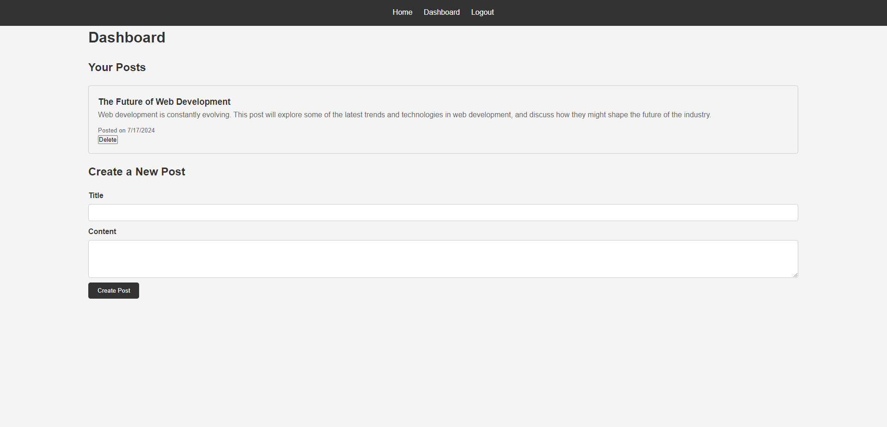
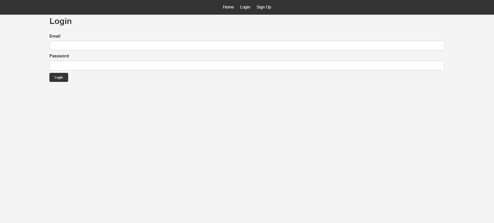
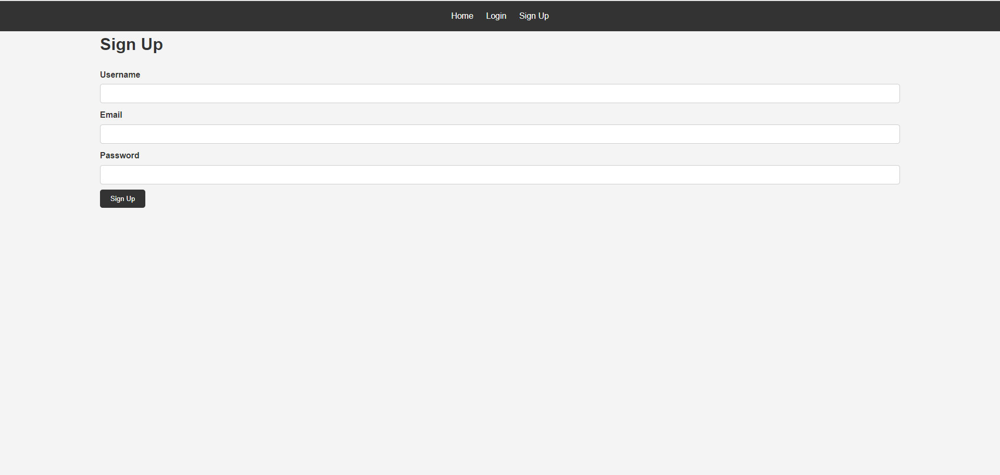

# Tech Blog

## Description

Tech Blog is a CMS-style blog site similar to WordPress, where developers can publish their blog posts and comment on others' posts as well. This site is built using Handlebars.js as the templating language, Sequelize as the ORM, and the express-session npm package for authentication. The site follows the MVC paradigm and is deployed on Render.

## Table of Contents

- Installation
- Usage
- Screenshots
- License
- Contributing
- Questions

## Installation

1. Clone the repository

```bash
git clone https://github.com/BrendaHaight/tech-blog.git
```

2. Navigate to the project directory:

```bash
cd tech-blog
```

3. Install the dependencies

```bash
npm install
```

4. Create a `.env` file in the root of the project and add your database credentials:

```bash
DB_NAME='tech_db'
DB_USER='your-username'
DB_PASSWORD='your-password'
SECRET='your-secret'
```

5. Initialize the database:

```bash
npm run seed
```

6. Start the server:

```bash
npm start
```

## Usage

- To start the application, run npm start and open your browser to `http://localhost:3001`.

- Sign up for an account.

- Log in with your credentials.

- Create, view, update, and delete blog posts.

- Comment on blog posts.

## Screenshots

_Caption: Homepage showing list of blog posts._



_Caption: User dashboard with options to create, update, and delete posts._


_Caption: login._



_Caption: Signup._



## Questions

If you have any questions about the repo, open an issue or contact me directly at brendahaightt@gmail.com. You can find more of my work at [Brenda Haight](https://github.com/brendaHaight).
